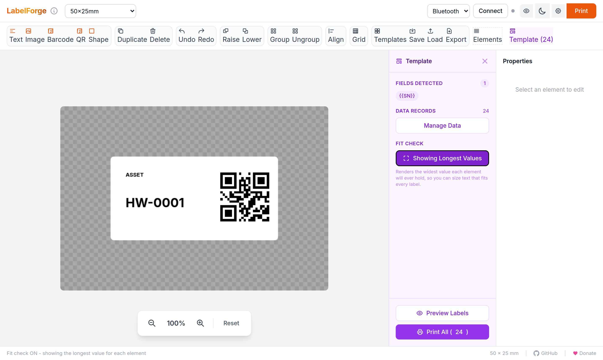
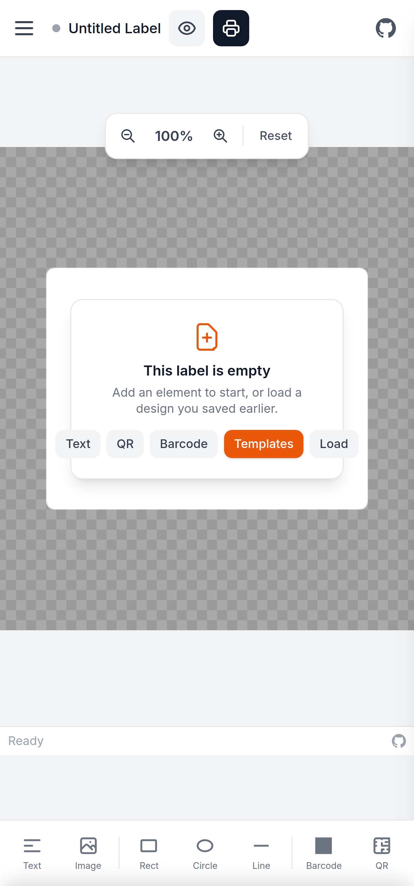
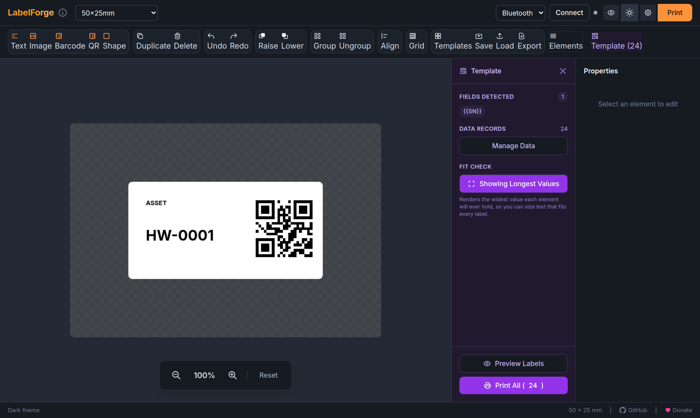

# LabelForge

A free, browser-based label designer for Phomemo thermal printers. No drivers needed - connects via Bluetooth or USB.


<p>
  
  
</p>

<p>
  
</p>

## Quick Start

Serve `src/web/` and open it in Chrome. Web Bluetooth requires HTTPS or localhost, so a plain file:// URL will not work:

```bash
cd src/web
python3 -m http.server 8080
# Open http://localhost:8080 in Chrome
```

Then click **Connect** to pair with your printer via Bluetooth (or **USB** for PM-241), design your label, and click **Print**.

A full walkthrough with screenshots lives in the [user manual](docs/manual.md), also served alongside the app at `/docs/manual.html`.

**Requires:** Chrome, Edge, or another Chromium-based browser. Web Bluetooth is not available in Firefox or Safari. Android Chrome is supported with full touch UI; iOS is not supported. PM-241 printers require USB (WebUSB).

## Features

**Design Elements** - Text (multiple fonts including local system fonts, sizes, styles, alignment, background colors), images with scale/aspect lock, barcodes (Code128, EAN-13, UPC-A, Code39), QR codes, and shapes (rectangle, ellipse, triangle, line) with solid, dithered grayscale, and stroke fills.

**Editing** - Drag to move, corner/edge resize handles, rotation. Multi-select (Shift+click on the canvas or in the Elements list), grouping (Ctrl/Cmd+G), undo/redo, keyboard nudge, layer ordering, clipboard image paste (Ctrl/Cmd+V).

**Align & Distribute** - With two or more elements selected, the **Align** toolbar button lines them up by left, centre, right, top, middle or bottom edge. With three or more, it can also space them evenly across or down, equalising the gaps between elements rather than between their centres, so uneven sizes still look evenly spaced. Alignment uses each element's visual bounding box, so rotated elements line up by what you see.

**Label Sizes** - Preset sizes for each printer type, round labels, custom dimensions. Auto-switches based on connected printer. Multi-label rolls with clone or individual zone modes.

**Millimetres or Inches** - Set **Units** in Print Settings. Inch mode offers common US stock as presets (4x6, 4x3, 4x2, 3x2, 2.25x1.25, 2x1, 1.5x1, 1x1, 1x0.5), filtered to what your printer is wide enough to print, and custom sizes accept decimals like `2.25`. Only the display and input change - designs are stored and printed at identical dimensions either way, so switching units never resizes anything.

**Templates & Batch Printing** - Variable fields with `{{FieldName}}` syntax, CSV import and export, preview grid, and batch printing with progress tracking and per-label copies.

**Incremental Numbering** - Print a run of sequentially numbered labels without building a CSV, and pick up where the last run finished rather than reissuing numbers already stuck to something. See [Numbered Label Runs](#numbered-label-runs) below.

**Fit Check** - A field renders on the canvas as `{{SN}}`, which says nothing about how wide the real value will be, so text sized against it can overflow once the data lands. Fit Check swaps in the longest value each element will ever hold, so a design that fits under it fits every label in the run.

**Instant Expressions** - Dynamic values evaluated at print time with `[[expression]]` syntax, usable in text, barcodes, and QR codes:

| Expression | Result |
|------------|--------|
| `[[date]]` | Current date, `YYYY-MM-DD` |
| `[[time]]` | Current time, `HH:mm:ss` |
| `[[datetime]]` / `[[dt]]` | Both, `YYYY-MM-DD HH:mm:ss` |
| `[[timestamp]]` / `[[ts]]` | Unix milliseconds |
| `[[year]]` `[[month]]` `[[day]]` | Date parts, zero-padded |
| `[[hour]]` `[[minute]]` `[[second]]` | Time parts, zero-padded (`[[min]]` and `[[sec]]` also work) |

Add a custom format after a pipe - `[[date|MM/DD/YYYY]]`, `[[dt|DD.MM.YY hh:mm A]]`. Tokens: `YYYY YY MM M DD D HH H hh h mm m ss s A a Z`.

**Print Preview** - Toggle dither preview to see exact thermal print output before printing.

**Export** - Save/load designs to browser storage, export/import as JSON, export to PDF or PNG.

**Template Gallery** - Start from something rather than a blank label. Four built-in starters - asset tag, shipping label, cable label, storage jar - alongside thumbnails of everything you have saved, each rendered from the real design rather than a stock image. The asset tag and cable label ship with a `{{SN}}` field already in place, so they drop straight into the series generator.

**Grid, Snapping & Rulers** - An optional grid over the label, snap-to-grid while dragging, and rulers along the top and left edges ticked in your chosen unit. Spacing is entered in that unit too and stored in millimetres, so switching between mm and inches re-labels it rather than changing it. Snapping only applies while the grid is visible - snapping to an invisible grid feels broken rather than helpful.

**Grouped Toolbar & Empty State** - Tools sit in labelled clusters rather than one flat row of eighteen buttons, with the element-creating actions carrying the accent and Delete the only destructive colour. A blank label shows a starting point instead of nothing, with shortcuts to add text, a QR code or a barcode, or to load a saved design.

**Light & Dark Themes** - A token-based palette with a forge-orange accent, switchable from the header and remembered between visits. It follows your system preference on first load and is applied before first paint, so there is no flash of the wrong theme. Label previews stay paper-white in both themes, because a label is paper.

**Colorways** - Five accent palettes - Ember (the forge-orange default), Ocean, Forest, Orchid and Graphite - chosen under **Colorway** in Print Settings. The choice applies the moment you pick it, is independent of light/dark (each colorway carries its own value for both), and is remembered between visits. Only the accent ramp moves; surfaces and text are untouched, so contrast is unaffected, and printed labels never are.

**Mobile** - Touch UI with pinch-to-zoom, two-finger pan, and slide-up property panels. Designing, templates, the series generator and printing all work; grouping and the align tools are desktop-only.

**Printer Status** - Live battery level, paper status, firmware version, and serial number with auto-query on connect.

## Numbered Label Runs

To print 100 labels numbered 1 to 100 - serial numbers, asset tags, ticket stubs - you don't need a CSV.

1. **Add a field.** In a text element, click the purple **+ {{Field}}** button in the Properties panel, type a name like `SN`, and press Enter. You can also type `{{SN}}` yourself, wrapped in whatever else you need: `Item {{SN}}`.
2. **Reuse it wherever the number should appear.** Add a QR code and pick `{{SN}}` from its own **+ {{Field}}** dropdown, or embed it in a URL: `https://example.com/{{SN}}`. Any elements sharing a field name stay in lockstep, so the printed number and the number the QR encodes always match. Give elements *different* field names and each gets its own counter.
3. **Generate.** A purple **Template** button appears in the toolbar once a field is detected. Click it, then **Manage Data** > **Generate Series**.

Set how many labels you want, then configure each field:

| Setting | What it does |
|---------|--------------|
| Start | First number in the run |
| Step | Added per label; negative counts down |
| Digits | Zero-pads to this width, so `3` prints `001` |
| Prefix / Suffix | Literal text around the number, e.g. `SN-` |
| Same on every label | Pin the field to one fixed value instead of counting - useful for a batch or lot code |

Sample values update live under each field (`SN-001, SN-002, SN-003 ... SN-100`), so you can check the run before committing to it. **Existing data** chooses whether the run replaces the current records or is appended to them, which lets you build a run in stages or mix generated numbers with an imported CSV.

### Picking up where you left off

Once a run has printed, the app remembers where each field reached. Reopen **Generate Series** and Start is already set past the last printed number, with a note saying what it is continuing after - so printing 1-100 today and coming back tomorrow gives you 101 onward instead of a second set of 1-100.

The position comes from the values that actually reached the printer, so a run cancelled at label 63 resumes at 64, not 101. Use **Start over** next to that note to forget the history and begin the field again.

Click **Generate** to fill the table. Before printing, hit **Show Longest Values** under Fit Check in the template panel - the canvas switches to the widest value each element will ever hold, so you can confirm a ten-digit serial still fits. The Properties panel keeps showing the editable `{{SN}}` text while the canvas previews real data.

Then **Preview Labels** to check the result, or **Print All** to print the run with a progress bar you can cancel.

## Supported Printers

| Model | Width | Notes |
|-------|-------|-------|
| P12 / P12 Pro | 12mm | Continuous tape label maker |
| A30 | 12-15mm | Continuous tape, faster print speed |
| M02 / M02S / M02X | 48mm (384px) | Mini pocket printers, continuous paper |
| M02 Pro | 53mm (626px) | 300 DPI high-resolution mini printer |
| M03 | 53mm (432px) | Mini sticker printer |
| T02 | 48mm (384px) | Mini sticker printer |
| M04S / M04AS | 53/80/110mm | 300 DPI multi-width printer (select paper size in settings) |
| M110 / M120 | 48mm (384px) | Narrow label makers |
| M200 / M250 | 75mm (608px) | Mid-size labels |
| M220 / M221 | 72mm (576px) | Wide labels |
| M260 | 72mm (576px) | Wide label maker |
| D30 / D35 / D50 / D110 | 12-15mm | Smart mini label makers (rotated protocol) |
| Q30 / Q30S | 12-15mm | Similar to D30 |
| PM-241 / PM-241-BT | 102mm (4") | Shipping labels, USB only (TSPL protocol) |

The app auto-detects your printer model from the Bluetooth device name and configures the correct protocol, print width, DPI, and label presets. If auto-detection fails, you can manually select your model in Print Settings, or the app will prompt you on first connection.

D-series printers print labels rotated 90° - the app handles this automatically. PM-241 printers use Bluetooth Classic (not BLE), so use the USB connection instead.

## Custom Printer Definitions

You can add, edit, and override printer definitions through **Print Settings > Manage Printers**. This lets you:

- **Add new printers** not yet in the built-in list with your own protocol, width, DPI, and alignment settings
- **Override built-in printers** to adjust settings like alignment or width for your specific hardware
- **Set auto-detect patterns** so your custom definitions are recognized automatically by BLE device name

Custom definitions are saved in your browser's localStorage and take priority over built-ins. Modified built-in printers can be reset to defaults at any time.

Built-in definitions are loaded from `printers.json` at startup.

## Keyboard Shortcuts

| Shortcut | Action |
|----------|--------|
| `Ctrl/Cmd + Z` | Undo |
| `Ctrl/Cmd + Shift + Z` | Redo |
| `Ctrl/Cmd + D` | Duplicate selected |
| `Ctrl/Cmd + G` | Group selected |
| `Ctrl/Cmd + Shift + G` | Ungroup |
| `Ctrl/Cmd + V` | Paste image from clipboard |
| `Delete / Backspace` | Delete selected |
| `Arrow keys` | Nudge by 1px |
| `Shift + Arrow keys` | Nudge by 10px |
| `Shift + Click` | Add to selection |

## Connection Tips

When the Bluetooth device picker appears, select the device showing a **signal strength indicator**. Devices listed without signal strength may be cached/ghost entries that won't connect properly.

## Project Structure

```
labelforge/
├── src/
│   └── web/
│       ├── index.html     # Main UI
│       ├── app.js         # Application logic
│       ├── canvas.js      # Canvas rendering & dithering
│       ├── elements.js    # Element management
│       ├── handles.js     # Selection handles
│       ├── storage.js     # localStorage persistence
│       ├── templates.js   # Fields, CSV, expressions, series generation
│       ├── units.js       # Millimetre/inch conversion and formatting
│       ├── ble.js         # Web Bluetooth transport
│       ├── usb.js         # WebUSB transport
│       ├── printer.js     # Print protocols
│       ├── printers.json  # Built-in printer definitions
│       ├── constants.js   # Shared constants and label presets
│       ├── _headers       # Cloudflare Pages cache headers
│       ├── docs/          # User manual, served at /docs/manual.html
│       └── utils/
│           ├── bindings.js   # Event binding helpers
│           ├── errors.js     # Error handling
│           └── validation.js # Input validation
├── tests/                 # Playwright suite, also generates manual screenshots
├── docs/                  # User manual source and screenshots
├── vercel.json            # Vercel deployment config
└── README.md
```

All geometry is stored in millimetres at 8 px/mm (203 DPI). Inches are a display and input layer in `units.js`, so the canvas and print paths never see a unit setting.

## Development

The app has no build step. Serve `src/web/` and reload.

Tests are Playwright end-to-end specs that drive the real UI in Chromium:

```bash
npm install
npx playwright install chromium   # first run only
npm test                          # headless
npm run test:headed               # watch it drive the browser
```

The suite starts its own static server on port 8081, so nothing needs to be running first. It doubles as the screenshot generator for the user manual - running it rewrites the images under `docs/screenshots/`, so check those diffs before committing them.

## Deployment

The app is a static site - there is nothing to build and no runtime dependencies. Serve the contents of `src/web/` over HTTPS (Web Bluetooth will not work over plain HTTP).

Two host configs live in the repo, and they do not interfere with each other:

- `src/web/_headers` - cache headers for Cloudflare Pages, which serves `src/web` as the site root.
- `vercel.json` - points Vercel at `src/web`, skips the install and build steps, and sets the same cache headers. No dashboard configuration is needed; leave Vercel's Root Directory at the repository root so this file is picked up.

Both keep `index.html` uncached while allowing `.js` to be cached indefinitely, which is why every module is loaded through a `?v=` cache-buster.

**When you change a module, bump its `?v=` everywhere it is imported.** Browsers hold `.js` for a year under `immutable` and will not revalidate, so a new `app.js` paired with a stale dependency fails at module-link time and the whole app goes dead - no canvas, no working buttons. Every import must carry a version, and all importers of a module must agree on it; `tests/10-module-versions.spec.ts` enforces both.


## Support the Project

If LabelForge is useful to you, consider [supporting HackerHomeLab on Ko-fi](https://ko-fi.com/hackerhomelab) to help fund ongoing development.

## Acknowledgements

LabelForge began as a fork of [transcriptionstream/phomymo](https://github.com/transcriptionstream/phomymo), with early contributions from Brendan Matkin and Alec Holmes.

Printer protocol research: [vivier/phomemo-tools](https://github.com/vivier/phomemo-tools), [yaddran/thermal-print](https://github.com/yaddran/thermal-print), and ooki1jp (M04AS/M04S).

Libraries: JsBarcode, QRCode.js, jsPDF, Tailwind CSS.

## License

MIT - see [LICENSE](LICENSE). Derivation and third-party credits are recorded in [NOTICE](NOTICE).
